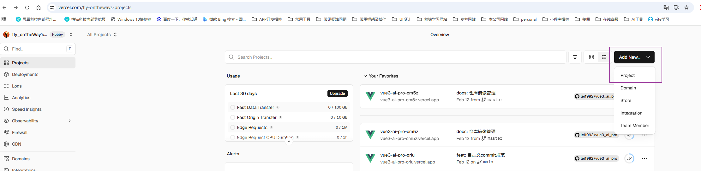
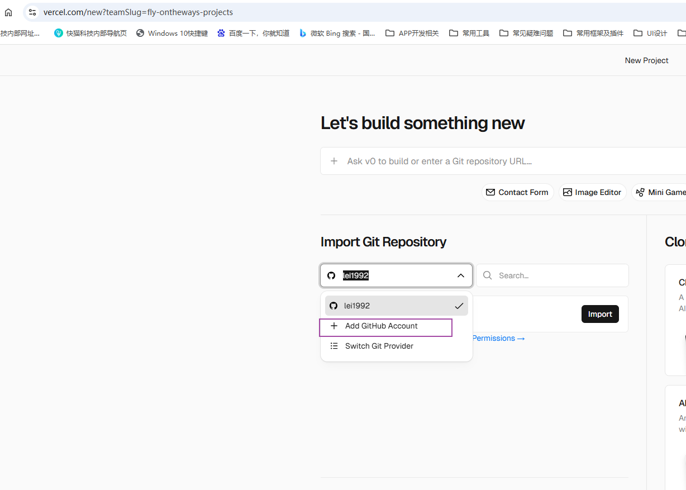
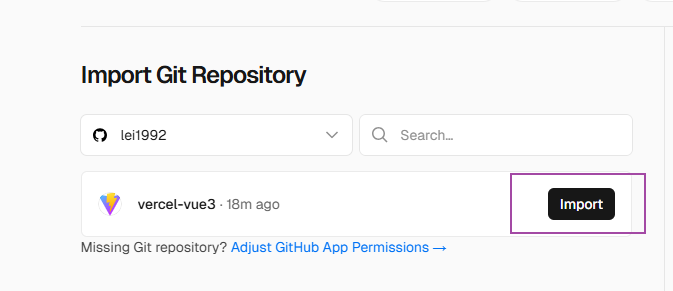
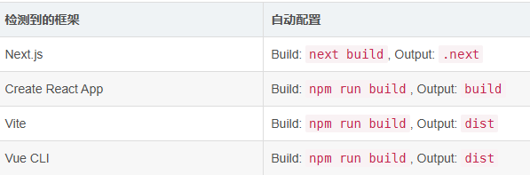
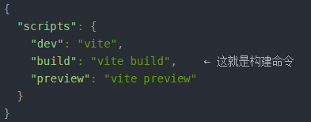
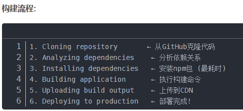

# Vercel部署全攻略:从GitHub到上线,10分钟让你的前端项目免费拥有自己的域名
如何用Vercel把你的前端项目部署到公网,让任何人都能通过一个链接访问你的作品。最重要的是:完全免费,无需服务器,10分钟搞定!
参考文档：https://blog.csdn.net/chendongqi2007/article/details/156579454

## 前提条件
- 一个GitHub账号：
- 一个Vercel账号：强烈推荐使用GitHub账号登录,这样可以直接授权访问你的仓库,省去后续连接的麻烦。
- 一个前端项目(React/Vue/Next.js等)，并将其推送到GitHub仓库。

Vercel只会读取你主动导入的仓库,不会访问其他私有仓库
疑问：仓库是私有的,我能不能部署到Vercel上?

## 步骤
1. 登录Vercel官网:https://vercel.com/
2. 点击右上角的"Sign up"按钮,使用GitHub账号登录
3. 在Vercel中创建一个新的项目,然后选择 “Add github account”(已添加则选择) ，连接你的GitHub账号，授权访问你的仓库。


4. 选中你的Vue项目,点击"Import"按钮,会进入配置页面。Vercel会自动检测你的项目类型和构建命令

核心配置项：
- 项目名称：输入你项目的名称,用于标识你的项目。
- 应用程序预设：
  Vercel会自动识别你的框架:
  
- 根目录：
```bash
  默认: ./
  用途: 如果你的前端代码在子目录(如packages/frontend)中,需要在这里指定

  示例:
  monorepo-project/
  ├── packages/
  │   ├── frontend/   ← 前端代码在这里
  │   └── backend/
  └── package.json

  配置: ./packages/frontend
```
- Build Command (构建命令)
  这是最重要的配置!Vercel会执行这个命令来构建你的项目。如何确认你的构建命令?
  打开项目的package.json,查看scripts字段:
  
  在Vercel配置中填写: npm run build
- Output Directory (输出目录)
  构建完成后,静态文件的输出位置。如何确认输出目录?
  在本地运行构建命令:
  ```bash
  npm run build
  ```
  查看生成的文件夹名称,那就是输出目录!
- Install Command (安装命令)
  默认情况下,Vercel会自动检测并使用:

  - npm install (如果有package-lock.json)
  - yarn install (如果有yarn.lock)
  - pnpm install (如果有pnpm-lock.yaml)
  通常不需要修改。

5. 点击"Deploy"按钮,等待Vercel构建并部署你的项目。构建完成后,你将看到你的项目在Vercel上的URL。
 